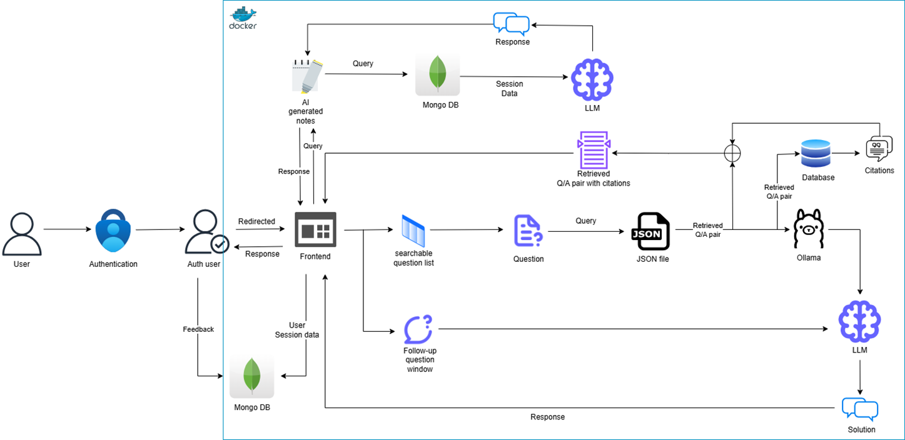

# GATE Exam Chatbot: RAG-Powered Study Assistant

A high-performance **Retrieval-Augmented Generation (RAG)** chatbot designed to help students prepare for the **GATE (Graduate Aptitude Test in Engineering)**. It retrieves exact solutions from past exam papers and uses **Llama-3-8B** to provide intelligent, context-aware explanations.

## 🏗️ System Architecture
The system follows a microservices architecture fully containerized with **Docker**.

*Figure 1: v0.2 Architecture - integrating Hybrid OCR, Weaviate Vector DB, and Llama-3 generation.*

### Key Components
1.  **Data Pipeline & OCR Strategy:**
    * **Exploration:** Evaluated multiple open-source pipelines including **Nougat**, **Tesseract OCR**, **LaTeX OCR**, and **LlamaParse**.
    * **Decision:** While **LlamaParse** showed promise, it was in an early development phase and suffered from hallucinations.
    * **Final Stack:** Adopted a hybrid approach using **Mathpix** (Deep Learning-based) for high-fidelity text extraction and **LLaVA** for parsing complex mathematical equations directly from images.
    * **Embedding:** **BGE-Small-EN-v1.5** selected for superior performance on mathematical datasets.

2.  **RAG Engine:**
    * **Vector Store:** **Weaviate** (Self-hosted via Docker).
    * **LLM:** **Llama3:8B-instruct-q2_K** (Quantized) running via **Ollama** for low-latency local inference.

3.  **User Interface:**
    * **Frontend:** **Next.js** with JWT authentication. Features a searchable dropdown for questions.
    * **Backend:** **FastAPI** handling asynchronous requests and MongoDB session storage.

## 🚀 Features (v0.2)
* **Exact Solution Retrieval:** Fetches the verified solution from the database to ensure 100% accuracy.
* **AI Explanations:** Users can ask follow-up questions ("Why is option B wrong?"), and Llama-3 explains using the retrieved context.
* **Smart Search:** Dropdown filter to find questions by Year (e.g., 2023) or Domain.
* **AI Notes:** Automatically summarizes study sessions into concise notes.

## 📊 Benchmarks & Evaluation
We conducted extensive benchmarking to select the optimal model configuration.

| LLM Model | Embedding Model | Faithfulness | Answer Relevance |
| :--- | :--- | :--- | :--- |
| **Llama-3:8B (Quantized)** | **BGE-Small** | **0.94** | **0.83** |
| Phi-3 | BGE-Small | 0.87 | 0.78 |
| GPT-3.5-turbo | N/A | 0.56 | 0.49 |

*Table 1: Evaluation results showing Llama-3's superior context adherence.*

## 🔐 Code Access
This repository serves as a showcase of the project's architecture and research outcomes. The full source code is hosted in a private repository to protect ongoing research and intellectual property.

**To request access to the codebase:**
Please send a code request stating your purpose (e.g., academic research, recruitment review, or collaboration) to the repository owner. Access will be granted on a case-by-case basis.

## 📸 Demo

*Figure 2: The student dashboard showing exact retrieval and AI follow-up.*

---
*Developed Summer 2024 as part of the Amulate Research Mentorship.*